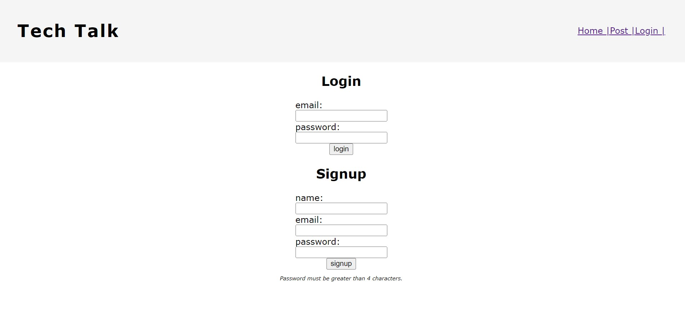

# 14-mvc-tech-blog

## Description

The [Tech Talk blog web application](https://tech-blog-mvc-kv.herokuapp.com/) can be used to post comments about tech related content.

## Table of Contents

- [Installation](#installation)

- [Usage](#usage)

- [Questions](#questions)

## Installation

1. Go to root directory
2. npm init -y
3. Type `npm i inquirer@8.2.4` in the terminal 
4. Type `npm install --save mysql2`
5. Type `npm install --save dotenv`
6. Type `npm install -- save express`
7. Type `npm install -- save sequelize`
7. Type `npm install -- save express-handlebars`
7. Type `npm install -- save bcrypt`
7. Type `npm install -- save connect-session-sequelize`
8. Open the mysql shell using `mysql -u root -p` (enter your password when prompted)
9. Within mysql shell, type `source db/schema.sql`
10. Within mysql shell, type `USE employee_db;`
11. Leave mysql shell by either typing `exit` or Ctrl+`c`
12. Back in the main bash terminal, type `npm run seeds` to seed the db
13. Type `node server.js` to begin the application
14. Access the application locally at "localhost:3001" in a modern web browser after running node server.js.

## Usage

This application is meant to be a platform for users to post about tech topics and interact with other users.

## Questions

Please contact [Katie Vlasic](https://github.com/katievlasic) with any questions.
